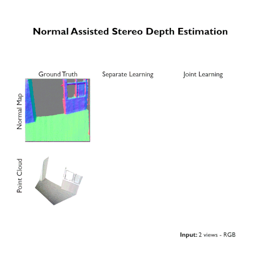

# Normal Assisted Stereo Depth Estimation

<p align="center">
    
</p>


## Introduction


Accurate stereo depth estimation plays a critical role in various 3D tasks in both indoor and outdoor environments. Recently, learning-based multi-view stereo methods have demonstrated competitive performance with limited number of views. However, in challenging scenarios, especially when building cross-view correspondences is hard, these methods still cannot produce satisfying results. In this paper, we study how to enforce the consistency between surface normal and depth at training time to improve the performance. We couple the learning of a multi-view normal estimation module and a multi-view depth estimation module. In addition, we propose a novel consistency loss to train an independent consistency module that refines the depths from depth/normal pairs. We find that the joint learning can improve both the prediction of normal and depth, and the accuracy and smoothness can be further improved by enforcing the consistency. Experiments on MVS, SUN3D, RGBD and Scenes11 demonstrate the effectiveness of our method and state-of-the-art performance.

If you find this project useful for your research, please cite: 
```
@InProceedings{Kusupati20,
  author={Kusupati, Uday and Cheng, Shuo and Chen, Rui and Su, Hao},
  title={Normal Assisted Stereo Depth Estimation},
  booktitle = {Proceedings of the IEEE Conference on Computer Vision and Pattern Recognition},
  month = {June},
  year = {2020}
}
```

## How to use

### Environment
pytorch/pytorch:1.1.0-cuda10.0-cudnn7.5-runtime

The environment requirements are listed as follows:
- Pytorch 1.0.1 
- CUDA 10.0 
- CUDNN 7

The following dockers are suggested:
- pytorch/pytorch:1.1.0-cuda10.0-cudnn7.5-runtime
- pytorch/pytorch:1.0.1-cuda10.0-cudnn7-runtime

### Preparation
* Check out the source code 

    ```git clone https://github.com/udaykusupati/NAS.git && cd NAS```
* Install dependencies 

    ```pip install pillow scipy==1.2.1 argparse tensorboardX progressbar2 path.py h5py blessings scikit-image```
* Prepare Training Data

    * [DeMoN datasets](https://github.com/lmb-freiburg/demon)

        * Follow data preparation instructions from [DPSNet](https://github.com/sunghoonim/DPSNet)
        * Download normal map data from [demon_normals.tar.gz](https://drive.google.com/drive/folders/1PTi37xlPxqhHNyxs_4xiGGj1OsnTQhWD?usp=sharing) and extract inside dataset directory

        ```
        |-- dataset
                |-- new_normals
                |-- preparation
                |-- test
                |-- train
        ```

    * [ScanNet](http://www.scan-net.org/)

        * Download [scannet.tar.gz](https://drive.google.com/drive/folders/1PTi37xlPxqhHNyxs_4xiGGj1OsnTQhWD?usp=sharing)
        * Download [new_orders.zip](https://drive.google.com/drive/folders/1PTi37xlPxqhHNyxs_4xiGGj1OsnTQhWD?usp=sharing) and extract in scannet directory

        ```
        |-- dataset
        |-- scannet
                |-- new_orders
                |-- test
                |-- test_scene.list
                |-- train
                |-- train_scene.list
                |-- val
                |-- val_scene.list
        ```

    * [SceneFlow datasets](https://lmb.informatik.uni-freiburg.de/resources/datasets/SceneFlowDatasets.en.html)

        * Follow dataset download and preparation instructions for "FlyingThings3D", "Driving" and "Monkaa" datasets from [GANet](https://github.com/feihuzhang/GANet) and create sceneflow directory.
        * Download [sceneflow_normals.tar.gz](https://drive.google.com/drive/folders/1PTi37xlPxqhHNyxs_4xiGGj1OsnTQhWD?usp=sharing) and extract in sceneflow directory

        ```
        |-- dataset
        |-- scannet
        |-- sceneflow
                |-- camera_data
                        |-- TEST
                        |-- TRAIN
                |-- disparity
                        |-- TEST
                        |-- TRAIN
                |-- frames_finalpass
                        |-- TEST
                        |-- TRAIN
                |-- lists
                |-- normals
                        |-- TEST
                        |-- TRAIN
                |-- sceneflow_test.list
                |-- sceneflow_train.list
        ```

* Download pretrained [models](https://drive.google.com/drive/folders/1PTi37xlPxqhHNyxs_4xiGGj1OsnTQhWD?usp=sharing) in pretrained folder


### Testing
    
* Test with the pretrained model without consistency module
    * DeMoN datasets

        ```python train.py ./dataset/train --ttype2 test.txt -e -np --pretrained-mvdn pretrained/mvdnet_demon.pth.tar --print-freq 1```
    * SUN3D

        ```python train.py ./dataset/train --ttype2 sun_test.txt -e --pretrained-mvdn pretrained/mvdnet_sun3d.pth.tar --print-freq 1```
    * ScanNet

        ```python train.py ./scannet --dataset scannet --ttype2 test.txt --mindepth 0.25 -e --pretrained-mvdn pretrained/mvdnet_scannet.pth.tar --print-freq 1```
    * SceneFlow datasets

        ```python train_sflow.py ./sceneflow --dataset sceneflow --ttype2 test.txt -e --pretrained-mvdn pretrained/mvdnet_sflow.pth.tar --print-freq 1```

* Test with the pretrained model with consistency module
    * SUN3D

        ```python train.py ./dataset/train --ttype2 sun_test.txt -e --pretrained-mvdn pretrained/mvdnet_sun3d.pth.tar --pretrained-cons pretrained/cons_sun3d.pth.tar -tc --print-freq 1```
    * ScanNet

        ```python train.py ./scannet --dataset scannet --ttype2 test.txt --mindepth 0.25 -e --pretrained-mvdn pretrained/mvdnet_scannet.pth.tar --pretrained-cons pretrained/cons_scannet.pth.tar -tc --print-freq 1```

### Training

* Training without the consistency module
    * DeMoN datasets

        ```python train.py ./dataset/train```
    * SUN3D

        ```python train.py ./dataset/train --ttype sun_train.txt --ttype2 sun_val.txt```
    * ScanNet

        ```python train.py ./scannet --dataset scannet --mindepth 0.25```
    * SceneFlow datasets

        The primary aim of training on SceneFlow datasets is to compare with [GANet](https://github.com/feihuzhang/GANet), an effective cost aggregation method and we compare it with the cost-aggregation implicitly caused by normal supervision. We set the disparity range to 192 similar to them but we only use 64 levels (sampled uniformly across 192 levels) due to memory constraints. We also set mindepth to 5.45 assuming the focal length to be 1050.0 mm, but for a few scenes with 450.mm it is adjusted appropriately (factor parameter in MVDNet.py)

        ```python train.py ./sceneflow --dataset sceneflow```
* Training with the consistency module
    * SUN3D

        ```python train.py ./dataset/train --ttype sun_train.txt --ttype2 sun_val.txt -tc```
    * ScanNet

        ```python train.py ./scannet --dataset scannet --mindepth 0.25 -tc```


### Acknowledgement
The code heavily relies on code from [DPSNet](https://github.com/sunghoonim/DPSNet/) (https://github.com/sunghoonim/DPSNet/)